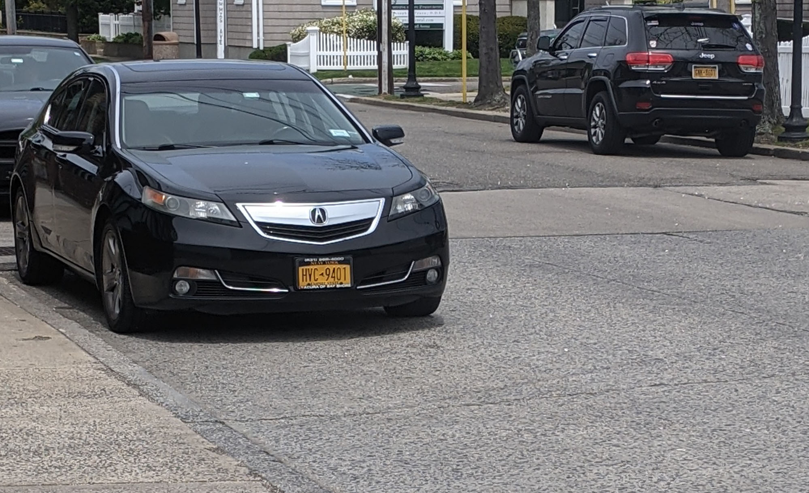
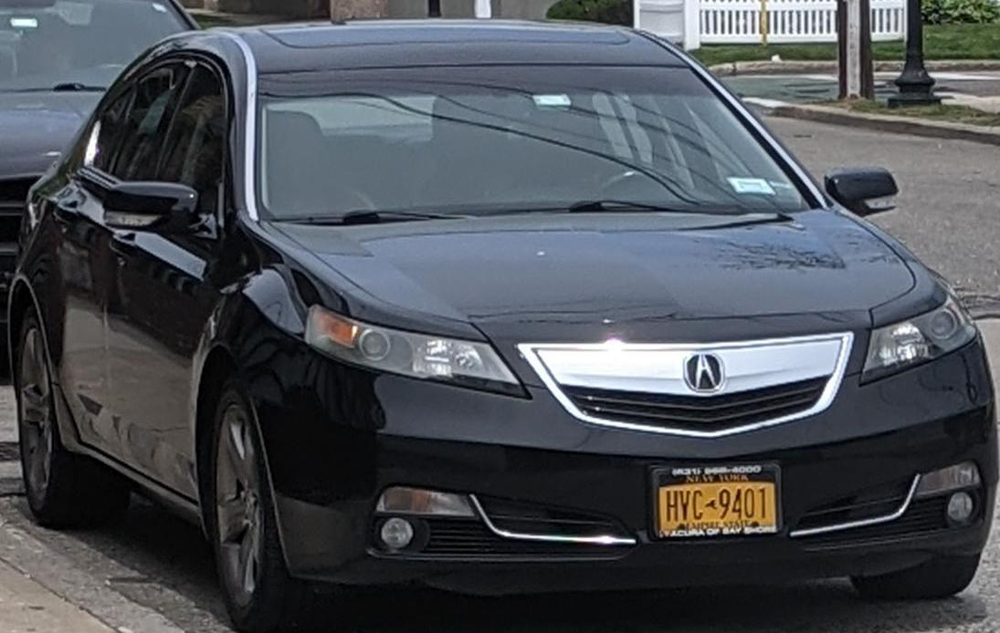
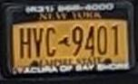
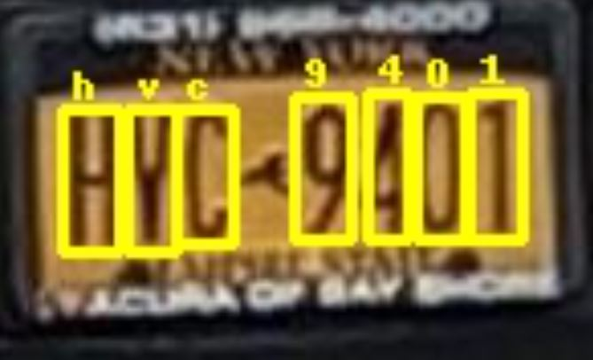

# deepstack_alpr_models

Use the lplate model to isolate a licence plate.  
Use the lplate_char model to recognize the characters.

Step 1:  Start with a photo of a vehicle.

Step 2:  Isolate the vehicle (Using deepstack object detection).

Step 3:  Isolate the plate (Using the custom deepstack lplate model).

Step 4:  Recognize characters (Using the custom deepstack lplate_char model).

Bonus:  I had to second guess myself on second character.   Turns out V is correct.  

https://findbyplate.com/US/NY/HVC9401/
